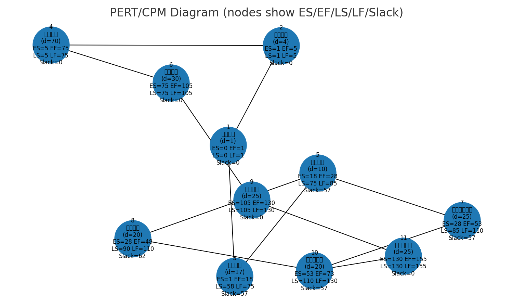

# hw2.md
## Task Data
| Task | Description | Duration (days) | Predecessor |
|------|--------------|----------------|--------------|
| 1 | Project planning 研擬計畫 | 1 | - |
| 2 | Task allocation 任務分配 | 4 | 1 |
| 3 | Obtain hardware 取得硬體 | 17 | 1 |
| 4 | Program development 程式開發 | 70 | 2 |
| 5 | Install hardware 安裝硬體 | 10 | 3 |
| 6 | Program testing 程式測試 | 30 | 4 |
| 7 | Write user manual 撰寫使用手冊 | 25 | 5 |
| 8 | File conversion 轉換檔案 | 20 | 5 |
| 9 | System testing 系統測試 | 25 | 6 |
| 10 | User training 使用者訓練 | 20 | 7,8 |
| 11 | User acceptance test 使用者測試 | 25 | 9,10 |

## PERT/CPM Diagram
Critical Path: **1 → 2 → 4 → 6 → 9 → 11**  
Total Duration: **155 days**

## Gantt Chart

## Notes
- Tasks on the critical path have zero slack.
- The project will take a total of 155 days.
